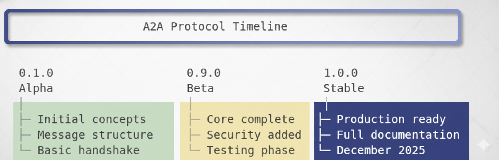

# Protocol Versions Reference

> **Learning Path**: Reference  
> **Difficulty**: Beginner to Intermediate  
> **Prerequisites**: [Core Concepts](../01_FUNDAMENTALS/01_core_concepts.md), [Agent Cards](../02_DISCOVERY/01_agent_cards.md)  
> **Completion Time**: 30-45 minutes

## Navigation
← Previous: [Capability Vocabulary](./capability_vocabulary.md) | Next: [Back to Overview](../00_A2A_OVERVIEW.md) →  
↑ Up: [A2A Overview](../00_A2A_OVERVIEW.md)

---

## 🎯 What You'll Learn

This reference document provides comprehensive information about A2A protocol versioning:

- [ ] Semantic versioning in A2A protocol
- [ ] Version history and changelog
- [ ] Breaking vs non-breaking changes
- [ ] Version negotiation patterns
- [ ] Migration guides between versions
- [ ] Deprecation policies
- [ ] Backward compatibility strategies

---

## 📚 Overview

**Protocol versioning** ensures that agents can evolve while maintaining compatibility with existing systems. The A2A protocol uses **semantic versioning** to communicate the nature and impact of changes.

### Why Versioning Matters

- ✅ **Compatibility** - Agents know if they can communicate
- ✅ **Evolution** - Protocol can improve over time
- ✅ **Clarity** - Changes are well-documented
- ✅ **Safety** - Breaking changes are explicit
- ✅ **Migration** - Upgrade paths are clear

---

## 🔢 Semantic Versioning

### Version Format

A2A protocol versions follow the pattern:

```
MAJOR.MINOR.PATCH

Example: 1.2.3
         │ │ └─ Patch: Bug fixes, no API changes
         │ └─── Minor: New features, backward compatible
         └───── Major: Breaking changes
```

### Version Components

#### **MAJOR Version** (Breaking Changes)

Increment when making incompatible API changes:
- Required field changes in messages
- Removal of message types
- Changed authentication requirements
- Modified message structure
- Incompatible protocol behavior

**Example**: `1.x.x` → `2.0.0`

#### **MINOR Version** (New Features)

Increment when adding backward-compatible functionality:
- New optional fields
- New message types
- New capabilities
- Additional authentication methods
- Performance improvements

**Example**: `1.2.x` → `1.3.0`

#### **PATCH Version** (Bug Fixes)

Increment for backward-compatible bug fixes:
- Documentation corrections
- Error message improvements
- Security patches (non-breaking)
- Performance optimizations

**Example**: `1.2.3` → `1.2.4`

---

## 📜 Version History

### Current Version: **1.0.0**

**Release Date**: December 2025  
**Status**: Current Stable

**Includes**:
- Core message types (request, response, handshake, error)
- Agent Card structure
- Basic authentication tags
- Standard capability vocabulary
- Discovery and registration patterns
- Streaming support (SSE)
- Error handling patterns

### Version Timeline


---

## 🔄 Change Types

### Breaking Changes (MAJOR)

**Definition**: Changes that require existing agents to modify their code.

**Examples**:

**1. Required Field Addition**
```json
// Version 1.x: Optional field
{
  "message_id": "...",
  "timestamp": "optional"
}

// Version 2.0: Now required (BREAKING)
{
  "message_id": "...",
  "timestamp": "required!"  // Agents must update
}
```

**2. Message Structure Change**
```json
// Version 1.x
{
  "payload": {
    "data": {...}
  }
}

// Version 2.0 (BREAKING)
{
  "payload": {
    "content": {...},  // Renamed from "data"
    "metadata": {...}   // New required field
  }
}
```

**3. Removed Message Type**
```json
// Version 1.x: Supported
"message_type": "legacy_handshake"

// Version 2.0: No longer supported (BREAKING)
// Must use "handshake" instead
```

### Non-Breaking Changes (MINOR)

**Definition**: Backward-compatible additions.

**Examples**:

**1. Optional Field Addition**
```json
// Version 1.2: Works with 1.x agents
{
  "message_id": "...",
  "timestamp": "...",
  "priority": "high"  // New optional field
}
```

**2. New Message Type**
```json
// Version 1.3: New, but 1.x agents unaffected
{
  "message_type": "streaming_subscribe"  // New type
}
```

**3. New Capability**
```json
// Version 1.4: New capability
{
  "capabilities": [
    "price_query",
    "batch_processing"  // New, agents can ignore if not needed
  ]
}
```

### Bug Fixes (PATCH)

**Definition**: Fixes that don't change behavior.

**Examples**:

**1. Documentation Fix**
```markdown
## Version 1.2.4
- Fixed typo in authentication documentation
- Clarified error code meanings
- Updated examples
```

**2. Error Message Improvement**
```python
# Version 1.2.3
raise ValidationError("Invalid")

# Version 1.2.4 (improved message, same behavior)
raise ValidationError("Invalid message_id format: expected UUID v4")
```

**3. Security Patch**
```python
# Version 1.2.5
# Fixed: Timing attack in signature verification
# Uses constant-time comparison now
```

---

## 🔍 Version Negotiation

### Declaring Supported Versions

Agents declare supported protocol versions in their Agent Card:

```json
{
  "agent_id": "crypto-agent-001",
  "name": "CryptoPriceAgent",
  "version": "2.1.0",  // Agent version
  "supported_protocols": [
    "A2A/1.0",
    "A2A/1.1",
    "A2A/1.2"
  ],
  "capabilities": [...]
}
```

### Version Compatibility Check

**Rule**: Agents can communicate if they share at least one MAJOR version.

```python
def can_communicate(agent_a: dict, agent_b: dict) -> bool:
    """Check if two agents can communicate"""
    protocols_a = set(agent_a["supported_protocols"])
    protocols_b = set(agent_b["supported_protocols"])
    
    # Find common protocols
    common = protocols_a & protocols_b
    
    if not common:
        return False
    
    # Use newest common version
    return True

# Example
agent_a = {"supported_protocols": ["A2A/1.0", "A2A/1.1"]}
agent_b = {"supported_protocols": ["A2A/1.1", "A2A/1.2"]}

can_communicate(agent_a, agent_b)  # True - both support 1.1
```

### Negotiation Pattern

```python
def negotiate_protocol(client_protocols: list, server_protocols: list) -> str:
    """
    Negotiate best protocol version
    
    Returns highest common version or raises IncompatibleError
    """
    client_set = set(client_protocols)
    server_set = set(server_protocols)
    
    # Find common protocols
    common = client_set & server_set
    
    if not common:
        raise IncompatibleProtocolError(
            f"No common protocol. Client: {client_protocols}, "
            f"Server: {server_protocols}"
        )
    
    # Parse versions
    def parse_version(proto: str) -> tuple:
        # "A2A/1.2" -> (1, 2)
        version = proto.split('/')[1]
        major, minor = version.split('.')
        return (int(major), int(minor))
    
    # Sort by version (newest first)
    sorted_common = sorted(
        common,
        key=parse_version,
        reverse=True
    )
    
    # Return newest common version
    return sorted_common[0]

# Example
client = ["A2A/1.0", "A2A/1.1", "A2A/1.2"]
server = ["A2A/1.1", "A2A/1.2", "A2A/1.3"]

protocol = negotiate_protocol(client, server)
print(protocol)  # "A2A/1.2" (newest common)
```

### Graceful Degradation

When agents support different versions, use the common subset:

```python
def get_available_features(protocol_version: str) -> set:
    """Get features available in this protocol version"""
    features = {
        "A2A/1.0": {
            "request", "response", "handshake", "error"
        },
        "A2A/1.1": {
            "request", "response", "handshake", "error",
            "streaming"  # Added in 1.1
        },
        "A2A/1.2": {
            "request", "response", "handshake", "error",
            "streaming",
            "batch_processing"  # Added in 1.2
        }
    }
    return features.get(protocol_version, set())

# Example
def make_request(agent_card: dict, data: dict):
    """Make request using best available protocol"""
    protocol = negotiate_protocol(
        my_protocols=["A2A/1.0", "A2A/1.1", "A2A/1.2"],
        their_protocols=agent_card["supported_protocols"]
    )
    
    features = get_available_features(protocol)
    
    if "streaming" in features and need_streaming:
        # Use streaming
        return stream_request(data)
    else:
        # Fall back to regular request
        return regular_request(data)
```

---

## 📖 Migration Guides

### Migrating from 1.0 to 1.1

**What Changed**:
- ✅ Added streaming support (non-breaking)
- ✅ Added `streaming` capability
- ✅ New `streaming_subscribe` message type

**Migration Steps**:

**Step 1: Update Agent Card**
```json
// Before (1.0)
{
  "supported_protocols": ["A2A/1.0"],
  "capabilities": ["price_query"]
}

// After (1.1) - Optional streaming
{
  "supported_protocols": ["A2A/1.0", "A2A/1.1"],
  "capabilities": [
    "price_query",
    "streaming"  // Optional: only if you support it
  ]
}
```

**Step 2: Implement Streaming (Optional)**
```python
# Only needed if you want streaming
from sse_server import SSEHandler

def handle_streaming_request(request):
    """Handle streaming subscriptions"""
    for event in generate_events():
        yield {
            "event": "price_update",
            "data": {...}
        }
```

**Step 3: Test Compatibility**
```python
# Test that you still work with 1.0 agents
def test_backward_compatibility():
    # Old agent connects (1.0)
    old_agent = {"supported_protocols": ["A2A/1.0"]}
    
    # Should negotiate to 1.0 (no streaming)
    protocol = negotiate_protocol(
        my_protocols=["A2A/1.0", "A2A/1.1"],
        their_protocols=old_agent["supported_protocols"]
    )
    
    assert protocol == "A2A/1.0"
```

### Migrating from 1.1 to 1.2

**What Changed**:
- ✅ Added batch processing support
- ✅ Added `batch_processing` capability
- ✅ New `batch_request` message type
- ✅ Improved error codes

**Migration Steps**: Similar to 1.0→1.1 (non-breaking)

---

## ⚠️ Deprecation Policy

### Deprecation Process

**Phase 1: Announcement** (Version X.Y)
- Feature marked as deprecated in documentation
- Deprecation warnings added to code
- Alternative approach documented

**Phase 2: Deprecation** (Version X.Y+1)
- Feature still works but logs warnings
- "Deprecated" badge in documentation
- Migration guide published

**Phase 3: Removal** (Version X+1.0)
- Feature removed in next major version
- Breaking change documented
- Migration required

### Example Deprecation

```python
# Version 1.2: Deprecation announced
def old_method():
    """
    DEPRECATED: Use new_method() instead.
    Will be removed in version 2.0.
    """
    warnings.warn(
        "old_method() is deprecated, use new_method()",
        DeprecationWarning,
        stacklevel=2
    )
    return legacy_behavior()

# Version 2.0: Removed
# old_method() no longer exists
```

### Deprecation Checklist

When deprecating a feature:

- [ ] Announce in release notes
- [ ] Add deprecation warning in code
- [ ] Document alternative approach
- [ ] Provide migration guide
- [ ] Allow full major version cycle
- [ ] Remove in next major version

---

## 🔄 Backward Compatibility Strategies

### Strategy 1: Optional Fields

**Add new features as optional**:

```json
{
  "message_id": "...",
  "timestamp": "...",
  "new_field": "..."  // Optional, old agents ignore
}
```

**Handling**:
```python
def handle_message(message: dict):
    # Required fields
    message_id = message["message_id"]  # Always present
    
    # Optional fields (with defaults)
    priority = message.get("priority", "normal")
    new_feature = message.get("new_field", None)
    
    # Process with optional features if present
    if new_feature:
        use_new_feature(new_feature)
```

### Strategy 2: Feature Detection

**Check capabilities before use**:

```python
def request_data(agent_card: dict, data: dict):
    """Request data using best available method"""
    capabilities = agent_card["capabilities"]
    
    if "streaming" in capabilities:
        # Agent supports streaming
        return request_streaming(data)
    elif "batch_processing" in capabilities:
        # Fall back to batch
        return request_batch(data)
    else:
        # Fall back to basic request
        return request_basic(data)
```

### Strategy 3: Version-Specific Behavior

**Adapt behavior based on negotiated version**:

```python
def format_message(data: dict, protocol: str) -> dict:
    """Format message for specific protocol version"""
    
    if protocol == "A2A/1.0":
        # Basic format
        return {
            "message_id": data["id"],
            "payload": data["payload"]
        }
    
    elif protocol == "A2A/1.1":
        # Add streaming metadata if available
        message = {
            "message_id": data["id"],
            "payload": data["payload"]
        }
        if "stream_id" in data:
            message["stream_metadata"] = {...}
        return message
    
    elif protocol >= "A2A/1.2":
        # Full format with all features
        return {
            "message_id": data["id"],
            "payload": data["payload"],
            "metadata": data.get("metadata", {}),
            "priority": data.get("priority", "normal")
        }
```

---

## 🧪 Version Testing

### Testing Compatibility

**Test Matrix**:

| Your Version | Test Against | Expected Result |
|--------------|--------------|-----------------|
| 1.2 | 1.0 agent | Works (negotiate to 1.0) |
| 1.2 | 1.1 agent | Works (negotiate to 1.1) |
| 1.2 | 1.2 agent | Works (full features) |
| 1.2 | 2.0 agent | May fail (major version mismatch) |

**Test Code**:

```python
import pytest

def test_version_negotiation():
    """Test version negotiation with different agents"""
    
    my_agent = {
        "supported_protocols": ["A2A/1.1", "A2A/1.2"]
    }
    
    # Test with older agent
    old_agent = {"supported_protocols": ["A2A/1.0", "A2A/1.1"]}
    protocol = negotiate_protocol(
        my_agent["supported_protocols"],
        old_agent["supported_protocols"]
    )
    assert protocol == "A2A/1.1"  # Newest common
    
    # Test with newer agent
    new_agent = {"supported_protocols": ["A2A/1.2", "A2A/1.3"]}
    protocol = negotiate_protocol(
        my_agent["supported_protocols"],
        new_agent["supported_protocols"]
    )
    assert protocol == "A2A/1.2"  # Newest common
    
    # Test with incompatible agent
    incompatible = {"supported_protocols": ["A2A/2.0", "A2A/2.1"]}
    with pytest.raises(IncompatibleProtocolError):
        negotiate_protocol(
            my_agent["supported_protocols"],
            incompatible["supported_protocols"]
        )

def test_graceful_degradation():
    """Test that features gracefully degrade"""
    
    # Agent only supports 1.0 (no streaming)
    agent_card = {
        "supported_protocols": ["A2A/1.0"],
        "capabilities": ["price_query"]
    }
    
    # Should fall back to non-streaming
    assert "streaming" not in agent_card["capabilities"]
    
    # Request should work without streaming
    response = make_request(agent_card, {"currency": "BTC"})
    assert response["status"] == "success"

def test_version_specific_behavior():
    """Test version-specific message formatting"""
    
    data = {
        "id": "123",
        "payload": {"test": "data"},
        "priority": "high"
    }
    
    # Format for 1.0 (basic)
    msg_1_0 = format_message(data, "A2A/1.0")
    assert "priority" not in msg_1_0  # Not in 1.0
    
    # Format for 1.2 (full)
    msg_1_2 = format_message(data, "A2A/1.2")
    assert msg_1_2["priority"] == "high"  # Included in 1.2
```

---

## 📋 Version Declaration Checklist

### For Agent Developers

When declaring protocol versions:

- [ ] **List all supported major versions** (e.g., "A2A/1.0", "A2A/1.1")
- [ ] **Test with each declared version** (ensure you actually support it)
- [ ] **Document version-specific features** (what works in each)
- [ ] **Implement graceful degradation** (fall back to common subset)
- [ ] **Handle incompatible versions** (clear error messages)
- [ ] **Keep agent version separate** (agent version ≠ protocol version)
- [ ] **Update when adding features** (add new minor version)
- [ ] **Follow deprecation policy** (one major version notice)

### For Protocol Designers

When creating new protocol versions:

- [ ] **Follow semantic versioning** (MAJOR.MINOR.PATCH)
- [ ] **Document all changes** (changelog with examples)
- [ ] **Provide migration guide** (step-by-step instructions)
- [ ] **Maintain backward compatibility** (for MINOR/PATCH)
- [ ] **Announce breaking changes early** (deprecation warnings)
- [ ] **Test with existing agents** (compatibility matrix)
- [ ] **Update schema definitions** (JSON Schema, TypeScript, etc.)
- [ ] **Version documentation** (docs for each version)

---

## 🎓 Best Practices

### DO ✅

1. **Support Multiple Versions**
   ```json
   {
     "supported_protocols": ["A2A/1.0", "A2A/1.1", "A2A/1.2"]
   }
   ```

2. **Negotiate to Newest Common**
   ```python
   protocol = negotiate_protocol(my_versions, their_versions)
   # Use best available features
   ```

3. **Test Backward Compatibility**
   ```python
   test_with_version("A2A/1.0")  # Ensure old agents work
   ```

4. **Document Version Requirements**
   ```markdown
   ## Version Support
   - Requires: A2A/1.1 or higher
   - Streaming: A2A/1.1+
   - Batch: A2A/1.2+
   ```

5. **Use Semantic Versioning**
   ```
   1.2.3 → Clear what changed
   ```

### DON'T ❌

1. **Don't Break Without Major Bump**
   ```python
   # Bad: Breaking change in minor version
   # 1.2 → 1.3 with required field change
   
   # Good: Breaking change in major version
   # 1.2 → 2.0 with required field change
   ```

2. **Don't Claim Unsupported Versions**
   ```json
   // Bad: Claims support but doesn't implement
   {
     "supported_protocols": ["A2A/1.0", "A2A/1.1", "A2A/1.2"]
     // Only actually supports 1.0!
   }
   ```

3. **Don't Remove Features Without Warning**
   ```python
   # Bad: Immediate removal
   # Version 1.5: feature() exists
   # Version 1.6: feature() removed ← No warning!
   
   # Good: Deprecation cycle
   # Version 1.5: feature() deprecated
   # Version 2.0: feature() removed
   ```

4. **Don't Mix Agent and Protocol Versions**
   ```json
   {
     "version": "2.1.0",  // Agent version
     "supported_protocols": ["A2A/1.2"]  // Protocol version
     // These are separate!
   }
   ```

5. **Don't Assume Latest Version**
   ```python
   # Bad: Assumes everyone has latest
   if not "streaming" in message:
       raise Error("Streaming required")
   
   # Good: Check and adapt
   if "streaming" in their_capabilities:
       use_streaming()
   else:
       use_fallback()
   ```

---

## 🔗 Related Documentation

- [Agent Cards](../02_DISCOVERY/01_agent_cards.md) - How versions are declared
- [Capability Vocabulary](./capability_vocabulary.md) - Version-specific capabilities
- [Message Schemas](./message_schemas.md) - Schema versioning
- [Core Concepts](../01_FUNDAMENTALS/01_core_concepts.md) - Protocol basics

---

## 📦 Version Quick Reference

### Current Versions

```
A2A Protocol Versions:
├── 1.0.0 (Stable) - December 2025
│   ├─ Core messages
│   ├─ Basic auth
│   └─ Discovery
├── 1.1.0 (Planned) - Q1 2026
│   └─ Streaming support
└── 1.2.0 (Planned) - Q2 2026
    └─ Batch processing
```

### Version Format

```
A2A/MAJOR.MINOR

Examples:
A2A/1.0  - Version 1.0
A2A/1.1  - Version 1.1
A2A/2.0  - Version 2.0 (breaking)
```

### Compatibility Rules

| Scenario | Compatible? |
|----------|-------------|
| 1.0 ↔ 1.1 | ✅ Yes |
| 1.0 ↔ 1.2 | ✅ Yes |
| 1.1 ↔ 1.2 | ✅ Yes |
| 1.x ↔ 2.x | ❌ No (major version difference) |

---

## 💡 Summary

**Key Takeaways**:

1. **Semantic Versioning** - MAJOR.MINOR.PATCH has specific meaning
2. **Backward Compatibility** - MINOR/PATCH versions must be compatible
3. **Version Negotiation** - Agents find newest common version
4. **Graceful Degradation** - Fall back to available features
5. **Deprecation Policy** - One major version warning before removal
6. **Testing** - Test with multiple versions
7. **Documentation** - Clear migration guides for each version

**Next Steps**:
1. Declare supported versions in your agent card
2. Implement version negotiation
3. Test with different protocol versions
4. Plan for future version upgrades

---

**Document Version**: 1.0  
**Last Updated**: December 2025  
**Protocol Version Covered**: A2A/1.0  
**Status**: Complete  
**Maintainer**: A2A Protocol Working Group