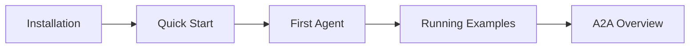
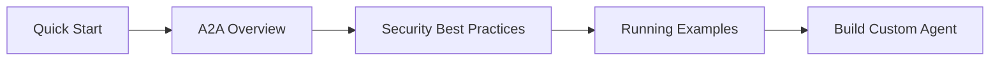
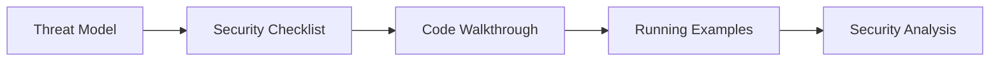
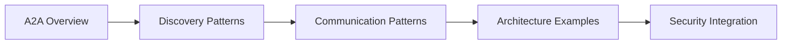

# How-To Guides

Practical, hands-on guides to help you get started with the Agent2Agent (A2A) protocol.

---

## 🚀 Quick Start Guides

### [Quick Start](quickstart.md)
**Get running in 10 minutes**

Set up your first A2A system:
- Start a registry
- Run a cryptocurrency agent
- Connect with a client
- Send your first A2A messages

**Prerequisites**: Python 3.10+  
**Time**: 10 minutes

### [Installation Guide](installation.md)
**Set up your environment**

Complete installation instructions:
- Virtual environment setup
- Dependency installation
- IDE configuration
- Troubleshooting common issues

**Prerequisites**: None  
**Time**: 15 minutes

### [First Agent Tutorial](first-agent.md)
**Build from scratch**

Create a complete A2A agent:
- Agent card creation
- Registry registration
- Capability implementation
- Client interaction

**Prerequisites**: Installation complete  
**Time**: 30-45 minutes

---

## 📚 Comprehensive Guides

### Security & Best Practices

#### [Security Checklist](security-checklist.md)
**Audit your A2A implementation**

Comprehensive security review:
- ✅ Authentication verification
- ✅ Message validation checks
- ✅ Session security audit
- ✅ PII protection review
- ✅ State management checks

**For**: Developers, Security Engineers  
**When**: Before production deployment

### Running Examples

#### [Running Examples](running-examples.md)
**Understand the example projects**

How to use the three main examples:
- **Crypto Agent**: Price queries and API integration
- **Credit Report Agent**: File handling and PII protection
- **Task Collaboration**: Multi-agent coordination

Each example shows progression:
1. ❌ Stage 1: Vulnerable baseline
2. ⚠️ Stage 2: Partial improvements
3. ✅ Stage 3+: Production-ready security

**For**: All levels  
**When**: After Quick Start

### Creating Content

#### [Presentation Guide](presentation-guide.md)
**Generate slides and documentation**

Create presentations about A2A:
- Slide generation from markdown
- Documentation export
- Diagram creation
- Best practices for technical presentations

**For**: Technical writers, Presenters  
**When**: Sharing A2A knowledge

---

## 🎯 Learning Paths

Choose your path based on your goals:

### For Beginners

**Goal**: Understand A2A basics and get started

**Recommended order**:
1. [Installation Guide](installation.md)
2. [Quick Start](quickstart.md)
3. [First Agent Tutorial](first-agent.md)
4. [Running Examples](running-examples.md)
5. [A2A Overview](../a2a/00_A2A_OVERVIEW.md)

**Time**: 2-3 hours

---

### For Developers

**Goal**: Build secure A2A agents

**Recommended order**:
1. [Quick Start](quickstart.md)
2. [A2A Overview](../a2a/00_A2A_OVERVIEW.md)
3. [Security Best Practices](../a2a/03_SECURITY/04_security_best_practices.md)
4. [Running Examples](running-examples.md)
5. [First Agent Tutorial](first-agent.md)
6. [Security Checklist](security-checklist.md)

**Time**: 4-6 hours

---

### For Security Professionals

**Goal**: Audit and secure agent systems

**Recommended order**:
1. [Threat Model](../a2a/03_SECURITY/03_threat_model.md)
2. [Security Checklist](security-checklist.md)
3. [Code Walkthrough](../a2a/03_SECURITY/05_code_walkthrough_comparison.md)
4. [Running Examples](running-examples.md)
5. [Stage 1 Security Analysis](../../a2a_examples/a2a_crypto_example/stage1_insecure/SECURITY_ANALYSIS.md)

**Time**: 6-8 hours

---

### For Architects

**Goal**: Design multi-agent systems

**Recommended order**:
1. [A2A Overview](../a2a/00_A2A_OVERVIEW.md)
2. [Agent Registry](../a2a/02_DISCOVERY/02_agent_registry.md)
3. [Protocol Messages](../a2a/04_COMMUNICATION/01_protocol_messages.md)
4. [Task Collaboration Example](../../a2a_examples/a2a_task_collab_example/)
5. [Security Best Practices](../a2a/03_SECURITY/04_security_best_practices.md)

**Time**: 8-10 hours

---

## 🔧 By Technology

### Python Development

- [Installation Guide](installation.md) - Virtual environments, pip/uv
- [UV Package Manager Guide](../supplementary/tools/uv-guide.md) - Modern Python dependency management
- [Running Examples](running-examples.md) - Python-based examples

### Web Development

- [Quick Start](quickstart.md) - FastAPI-based registry
- [Task Collaboration Example](../../a2a_examples/a2a_task_collab_example/stage5_web_framework/) - Web interface

### DevOps

- [Installation Guide](installation.md) - Environment setup
- [Running Examples](running-examples.md) - Multi-process management
- [Security Checklist](security-checklist.md) - Production readiness

---

## 📖 Additional Resources

### Core Documentation
- [Complete Documentation Index](../a2a/INDEX.md)
- [A2A Protocol Overview](../a2a/00_A2A_OVERVIEW.md)
- [Security Documentation](../a2a/03_SECURITY/01_authentication_overview.md)

### Example Projects
- [Crypto Price Agent](../../a2a_examples/a2a_crypto_example/)
- [Credit Report Agent](../../a2a_examples/a2a_credit_report_example/)
- [Task Collaboration Agent](../../a2a_examples/a2a_task_collab_example/)

### Tools & Utilities
- [UV Package Manager](../supplementary/tools/uv-guide.md)
- [Link Checker](../supplementary/tools/link-checker.md)

---

## 💡 Guide Conventions

### Difficulty Levels

- 🔰 **Beginner** - No prior A2A knowledge required
- 📚 **Intermediate** - Requires basic A2A understanding
- 🎓 **Advanced** - Requires comprehensive A2A knowledge

### Time Estimates

- ⏱️ **Quick** - Under 15 minutes
- ⏰ **Standard** - 15-60 minutes
- 📅 **Extended** - 1+ hours

### Prerequisites

Each guide clearly lists:
- Required prior knowledge
- Software dependencies
- Hardware requirements
- Time commitment

---

## 🎯 Quick Reference

| Need | Guide | Time | Level |
|------|-------|------|-------|
| Get started fast | [Quick Start](quickstart.md) | 10 min | 🔰 |
| Set up environment | [Installation](installation.md) | 15 min | 🔰 |
| Build first agent | [First Agent](first-agent.md) | 45 min | 📚 |
| Understand examples | [Running Examples](running-examples.md) | 30 min | 📚 |
| Security audit | [Security Checklist](security-checklist.md) | 60 min | 🎓 |
| Create presentations | [Presentation Guide](presentation-guide.md) | 30 min | 📚 |

---

## 📬 Getting Help

### Documentation Issues
If you find errors or have suggestions:
1. Check the [Documentation Index](../a2a/INDEX.md)
2. Review related examples
3. Contact: robert@fischer3.net

### Technical Issues
For code or implementation questions:
1. Review the [Security Checklist](security-checklist.md)
2. Check [Troubleshooting](running-examples.md#troubleshooting)
3. Examine relevant example code

### Contributing
Want to improve these guides?
- Submit corrections
- Suggest new topics
- Share use cases
- Report unclear sections

---

## 🚀 Ready to Start?

**New to A2A?**  
→ Start with [Quick Start](quickstart.md)

**Want hands-on practice?**  
→ Try [First Agent Tutorial](first-agent.md)

**Need to secure production code?**  
→ Use [Security Checklist](security-checklist.md)

**Looking for examples?**  
→ See [Running Examples](running-examples.md)

---

## Next Steps

Choose your path:

[Quick Start →](quickstart.md){ .md-button .md-button--primary }
[Installation →](installation.md){ .md-button }
[First Agent →](first-agent.md){ .md-button }

---

**Last Updated**: December 2025  
**Maintainer**: Robert Fischer  
**Email**: robert@fischer3.net